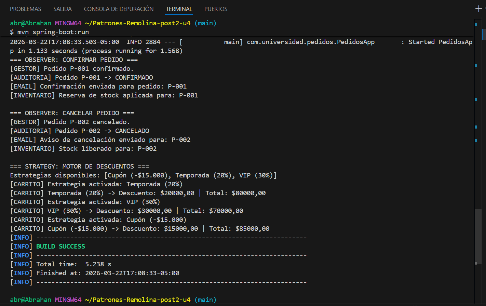
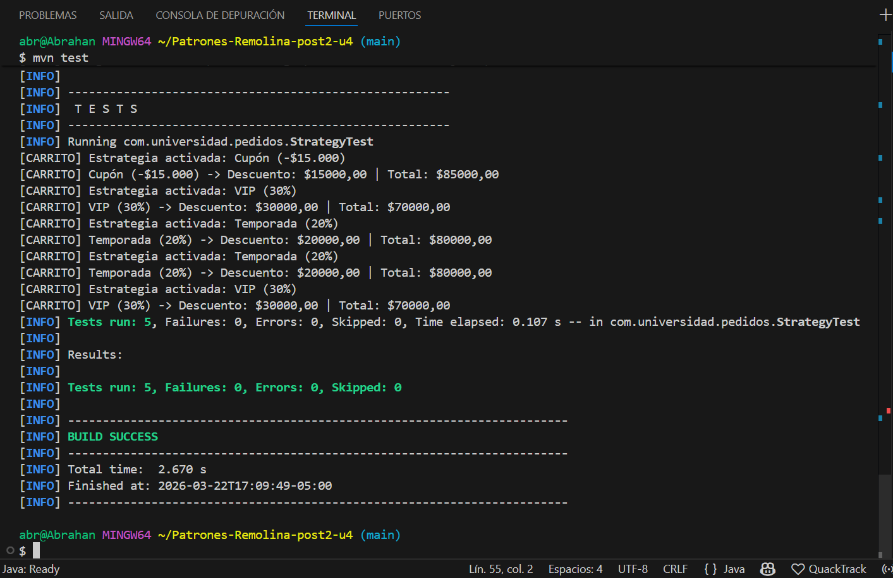

# Patrones-Remolina-post2-u4
## Unidad 4 – Post-Contenido 2 | Patrones de Comportamiento: Observer y Strategy

Proyecto Spring Boot que implementa los patrones de diseño **Observer** con 
Spring ApplicationEvents y **Strategy** para un motor de descuentos intercambiable,
en el contexto de un sistema de pedidos con notificaciones automáticas multicanal.

---

## Patrones aplicados

### Observer con Spring ApplicationEvents
Cuando el estado de un pedido cambia, `GestorPedidosService` publica un evento
sin conocer a sus suscriptores. Spring notifica automáticamente a todos los
`@Component` que escuchan con `@EventListener`.

| Participante | Clase |
|---|---|
| ApplicationEvent 1 | `PedidoConfirmadoEvent` |
| ApplicationEvent 2 | `PedidoCanceladoEvent` |
| Publisher | `GestorPedidosService` |
| Subscriber 1 | `EmailNotifier` |
| Subscriber 2 | `InventarioUpdater` |
| Subscriber 3 | `AuditoriaLogger` |

Flujo de eventos:
```
GestorPedidosService.confirmarPedido()
    → publica PedidoConfirmadoEvent
        → EmailNotifier.onConfirmado()
        → InventarioUpdater.onConfirmado()
        → AuditoriaLogger.onConfirmado()
```

Para agregar un nuevo suscriptor basta con crear un `@Component` con un
método anotado `@EventListener` — sin modificar `GestorPedidosService`.

### Strategy: Motor de Descuentos
`CarritoService` delega el cálculo del descuento a la estrategia activa,
seleccionable en tiempo de ejecución. Spring inyecta automáticamente todas
las implementaciones de `EstrategiaDescuento` como una lista.

| Participante | Clase |
|---|---|
| Strategy interface | `EstrategiaDescuento` |
| ConcreteStrategy 1 | `DescuentoTemporada` (20%) |
| ConcreteStrategy 2 | `DescuentoVIP` (30%) |
| ConcreteStrategy 3 | `DescuentoCupon` (-$15.000 fijo) |
| Context | `CarritoService` |

Para agregar una nueva estrategia solo se necesita crear un `@Service` que
implemente `EstrategiaDescuento` — sin modificar `CarritoService`.

---

## Estructura del proyecto
```
Patrones-Remolina-post2-u4/
├── img/
│   ├── runMain.png
│   └── tests.png
├── pom.xml
└── src/
    ├── main/
    │   └── java/com/universidad/pedidos/
    │       ├── PedidosApp.java
    │       ├── modelo/
    │       │   └── Pedido.java
    │       ├── observer/
    │       │   ├── PedidoConfirmadoEvent.java
    │       │   ├── PedidoCanceladoEvent.java
    │       │   ├── GestorPedidosService.java
    │       │   ├── EmailNotifier.java
    │       │   ├── InventarioUpdater.java
    │       │   └── AuditoriaLogger.java
    │       └── strategy/
    │           ├── EstrategiaDescuento.java
    │           ├── DescuentoTemporada.java
    │           ├── DescuentoVIP.java
    │           ├── DescuentoCupon.java
    │           └── CarritoService.java
    └── test/
        └── java/com/universidad/pedidos/
            └── StrategyTest.java
```

---

## Requisitos

- Java 17+
- Maven 3.8+
- Git

---

## Cómo ejecutar

### 1. Clonar el repositorio
```bash
git clone https://github.com/Abrahan07/Patrones-Remolina-post2-u4.git
cd Patrones-Remolina-post2-u4
```

### 2. Compilar el proyecto
```bash
mvn clean package
```

### 3. Ejecutar la aplicación
```bash
mvn spring-boot:run
```

### 4. Ejecutar las pruebas
```bash
mvn test
```

Se ejecutan 5 tests unitarios con JUnit 5:
- `testDescuentoTemporadaVeintePercent` — verifica descuento del 20% sobre $100.000.
- `testDescuentoVIPTreintaPercent` — verifica descuento del 30% sobre $100.000.
- `testDescuentoCuponFijo` — verifica cupón fijo de $15.000 sobre $100.000.
- `testCambioDeEstrategiaEnTiempoDeEjecucion` — verifica el swap de estrategia sin modificar CarritoService.
- `testEstrategiaInvalidaLanzaExcepcion` — verifica que una estrategia inexistente lanza excepción.

---

## Capturas de pantalla

### Ejecución de la aplicación


### Tests unitarios

